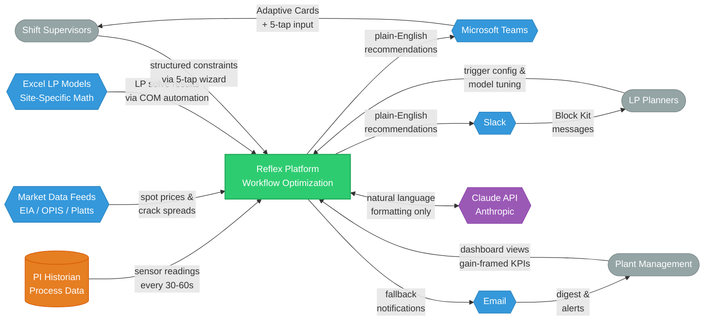
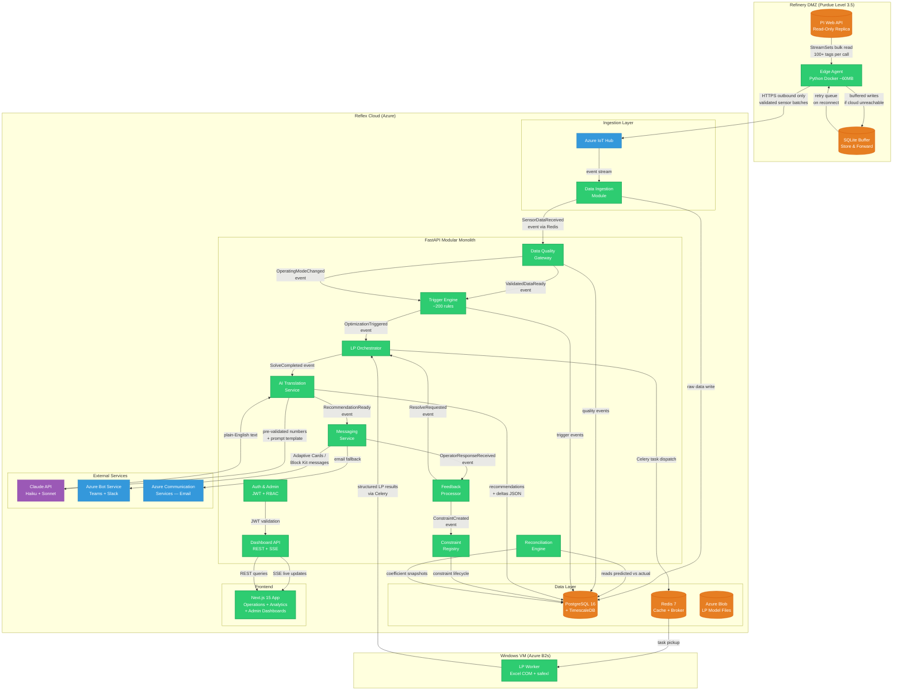
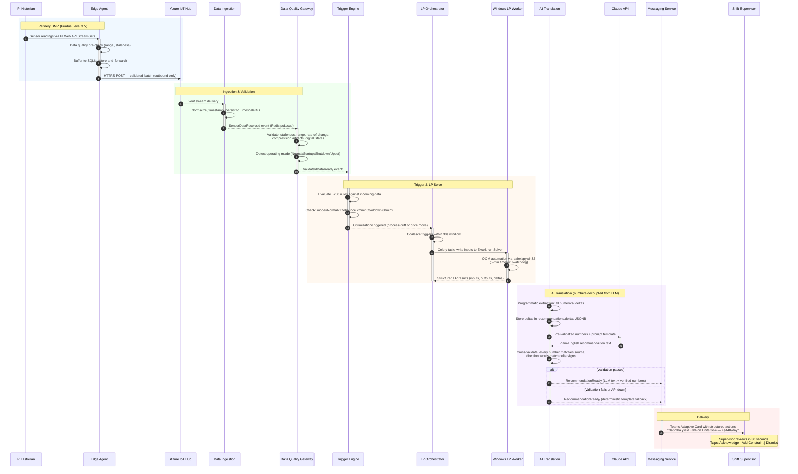
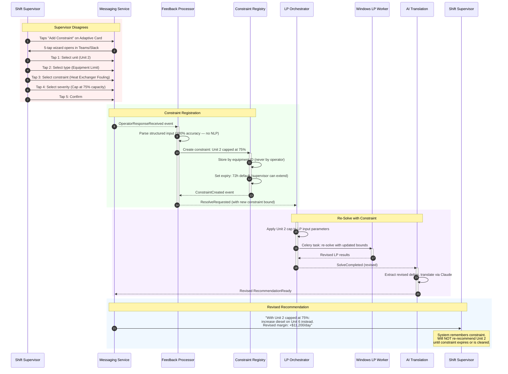
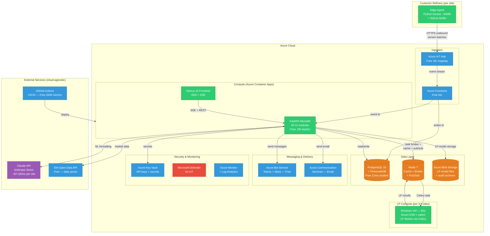
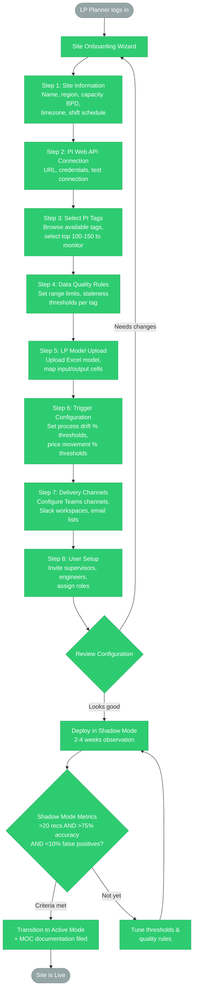
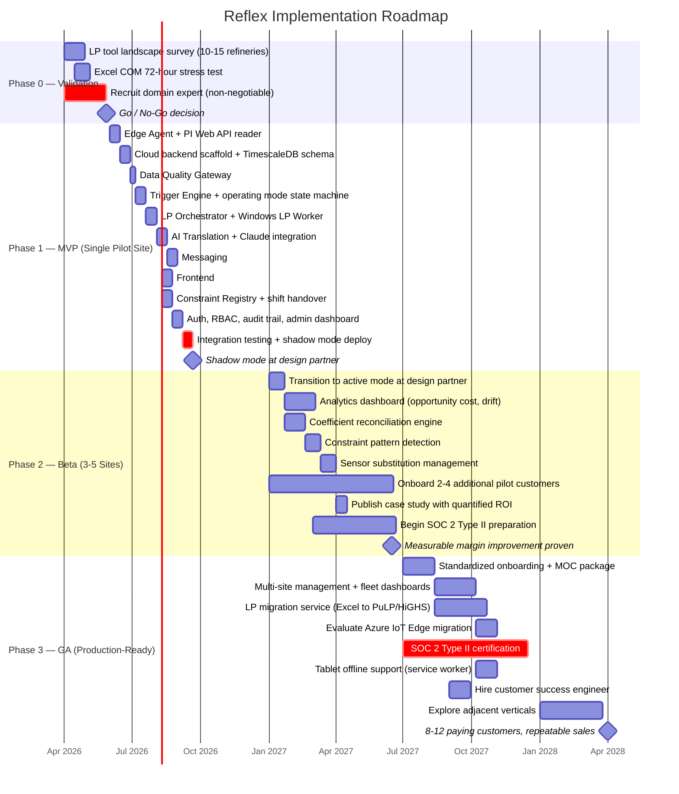

# Reflex Platform — Architecture Diagrams

> All diagrams use Mermaid syntax and render in GitHub, VS Code, and most markdown viewers.

**Color Legend (consistent across all diagrams):**
| Color | Meaning |
|-------|---------|
| Green (`#2ecc71`) | Reflex-owned services & components |
| Blue (`#3498db`) | External systems & integrations |
| Orange (`#e67e22`) | Data stores & databases |
| Red (`#e74c3c`) | Security boundaries & critical paths |
| Purple (`#9b59b6`) | AI/LLM components |
| Grey (`#95a5a6`) | Human actors & manual processes |

---

## 1. System Context Diagram (C4 Level 1)

Shows Reflex as a system-in-context with all external actors and systems it interacts with. Key thing to notice: Reflex sits between three existing pillars (historian, LP model, operators) that are currently disconnected — it is the "wire" connecting them.


<details>
<summary>View Mermaid source</summary>



</details>

---

## 2. Container Diagram (C4 Level 2)

Shows all containers and services within the Reflex platform. Key thing to notice: the cloud backend is a **modular monolith** — all modules run in one FastAPI process except the Windows LP Worker (separate due to Excel COM requirements).


<details>
<summary>View Mermaid source</summary>



</details>

---

## 3a. Data Flow — Happy Path (Sequence Diagram)

Shows the complete end-to-end flow from a sensor reading change to a recommendation delivered to a shift supervisor. Key thing to notice: numbers are **never** generated by the LLM — they are programmatically extracted and cross-validated.


<details>
<summary>View Mermaid source</summary>



</details>

---

## 3b. Data Flow — Feedback & Constraint Path

Shows what happens when a shift supervisor disagrees with a recommendation. Key thing to notice: the system **never nags** — once a constraint is registered, conflicting recommendations are suppressed until a human explicitly clears it.


<details>
<summary>View Mermaid source</summary>



</details>

---

## 4. Network Architecture Diagram (OT/IT Boundary)

Shows the Purdue Model network segmentation. Key thing to notice: Reflex **never** accesses OT systems directly — the Edge Agent reads from a read-only PI replica in the DMZ and communicates outbound-only. No inbound firewall rules are ever required.

```mermaid
graph LR
    subgraph OT["Purdue Level 0-2: Process Control (OT Network)"]
        DCS[DCS / PLCs<br/>Process Control]:::critical
        SENSORS[Sensors<br/>100+ Tags]:::critical
        PIARCH[(PI Data Archive<br/>Primary)]:::datastore
        DCS ---|"control signals"| SENSORS
        SENSORS -->|"readings every 1s"| PIARCH
    end

    subgraph DMZ["Purdue Level 3.5: Demilitarized Zone"]
        PIREP[(PI Archive<br/>Read-Only Replica)]:::datastore
        PIAPI[PI Web API<br/>IIS / HTTPS:443]:::external
        EDGE[Reflex Edge Agent<br/>Python Docker ~60MB<br/>+ SQLite Buffer]:::reflex

        PIREP -->|"REST API queries<br/>Basic Auth / TLS"| PIAPI
        PIAPI -->|"StreamSets bulk read<br/>100+ tags per call"| EDGE
    end

    subgraph CLOUD["Purdue Level 4-5: IT Network / Cloud"]
        IOT[Azure IoT Hub]:::external
        MONOLITH[Reflex Cloud<br/>FastAPI Monolith]:::reflex
        DB[(PostgreSQL<br/>+ TimescaleDB)]:::datastore

        IOT -->|"event stream"| MONOLITH
        MONOLITH -->|"read/write"| DB
    end

    %% Cross-boundary flows
    PIARCH -->|"replication<br/>(AVEVA managed)"| PIREP
    EDGE -->|"HTTPS outbound ONLY<br/>validated sensor batches"| IOT

    %% Firewall annotations
    FW1{{"FIREWALL<br/>OT ↔ DMZ"}}:::firewall
    FW2{{"FIREWALL<br/>DMZ ↔ IT/Cloud"}}:::firewall

    OT ~~~ FW1
    FW1 ~~~ DMZ
    DMZ ~~~ FW2
    FW2 ~~~ CLOUD

    %% Styles
    classDef reflex fill:#2ecc71,stroke:#27ae60,color:#fff,stroke-width:2px
    classDef external fill:#3498db,stroke:#2980b9,color:#fff
    classDef datastore fill:#e67e22,stroke:#d35400,color:#fff
    classDef critical fill:#e74c3c,stroke:#c0392b,color:#fff,stroke-width:2px
    classDef firewall fill:#e74c3c,stroke:#c0392b,color:#fff,stroke-width:3px
```


<details>
<summary>View Mermaid source</summary>



</details>

**Security highlights:**
- Edge Agent is **read-only** — never writes to OT systems
- All communication is **outbound HTTPS only** from DMZ to cloud
- Compatible with hardware **data diodes** (physically one-way)
- Edge Agent authenticates to PI Web API via Basic Auth over TLS
- Microsoft Defender for IoT provides Purdue Model-aware OT monitoring

---

## 5. Database Schema (ER Diagram)

Shows the complete relational schema from the engineering spec. Key thing to notice: overrides and opportunity costs are tracked by **equipment/unit**, never by individual operator — this is an architectural enforcement of the gain-framing design (Risk R8).

```mermaid
erDiagram
    %% ── Core Configuration ──
    sites {
        uuid id PK
        string name
        string region
        int capacity_bpd
        string timezone
    }

    users {
        uuid id PK
        uuid site_id FK
        string email
        string role "admin|lp_planner|supervisor|management"
        string delivery_channel "teams|slack|email"
    }

    tag_config {
        uuid id PK
        uuid site_id FK
        string pi_web_id
        string tag_name
        float range_min
        float range_max
        string quality_rules "JSONB"
    }

    %% ── Trigger System ──
    trigger_rules {
        uuid id PK
        uuid site_id FK
        string trigger_type "process_drift|price_move|sensor_health"
        float threshold_pct
        int debounce_sec
        int cooldown_sec
        boolean enabled
    }

    operating_modes {
        uuid id PK
        uuid site_id FK
        string mode "Normal|Startup|Shutdown|Upset|Turnaround|Emergency"
        timestamp started_at
        timestamp ended_at
        uuid changed_by FK
    }

    %% ── LP System ──
    lp_models {
        uuid id PK
        uuid site_id FK
        string model_name
        string solver_type "excel_solver|pims|pulp_highs"
        string cell_mappings "JSONB — input/output cells"
        string blob_url "Azure Blob ref"
    }

    lp_runs {
        uuid id PK
        uuid site_id FK
        uuid lp_model_id FK
        uuid trigger_event_id FK
        string status "queued|running|completed|failed|timeout"
        string inputs "JSONB"
        string outputs "JSONB"
        int solve_time_ms
        timestamp created_at
    }

    %% ── Recommendations & Feedback ──
    recommendations {
        uuid id PK
        uuid site_id FK
        uuid lp_run_id FK
        string deltas "JSONB — programmatic numbers"
        string llm_text "Claude-generated prose"
        string template_text "deterministic fallback"
        boolean used_fallback
        float margin_delta_per_day
        string status "pending|acknowledged|constrained|dismissed"
        timestamp created_at
    }

    constraints {
        uuid id PK
        uuid site_id FK
        string equipment_id "by unit, NEVER by operator"
        string constraint_type
        string description
        float severity_value
        string source "structured_input|nlp_confirmed"
        timestamp expires_at
        boolean is_active
    }

    overrides {
        uuid id PK
        uuid site_id FK
        uuid recommendation_id FK
        string equipment_id "by unit, NEVER by operator"
        string response_type "acknowledged|constrained|dismissed"
        float margin_impact
        timestamp created_at
    }

    %% ── Analytics ──
    opportunity_costs {
        uuid id PK
        uuid site_id FK
        string equipment_id "by unit, NEVER by operator"
        float value_captured
        float value_identified
        date period_date
    }

    coefficient_snapshots {
        uuid id PK
        uuid site_id FK
        string unit_id
        string coefficients "JSONB — predicted vs actual yields"
        float max_drift_pct
        timestamp snapshot_at
    }

    sensor_substitutions {
        uuid id PK
        uuid site_id FK
        uuid original_tag_id FK
        uuid substitute_tag_id FK
        string reason
        boolean is_active
    }

    %% ── Audit ──
    audit_log {
        uuid id PK
        uuid site_id FK
        string event_type
        string actor "system|user_id"
        string details "JSONB"
        timestamp created_at
    }

    %% ── Relationships ──
    sites ||--o{ users : "has"
    sites ||--o{ tag_config : "monitors"
    sites ||--o{ trigger_rules : "configures"
    sites ||--o{ operating_modes : "tracks"
    sites ||--o{ lp_models : "owns"
    sites ||--o{ lp_runs : "executes"
    sites ||--o{ recommendations : "generates"
    sites ||--o{ constraints : "registers"
    sites ||--o{ overrides : "records"
    sites ||--o{ opportunity_costs : "measures"
    sites ||--o{ coefficient_snapshots : "reconciles"
    sites ||--o{ sensor_substitutions : "manages"
    sites ||--o{ audit_log : "audits"

    lp_models ||--o{ lp_runs : "solved by"
    lp_runs ||--o| recommendations : "produces"
    recommendations ||--o{ overrides : "responded to"
    tag_config ||--o{ sensor_substitutions : "original tag"
    tag_config ||--o{ sensor_substitutions : "substitute tag"
    users ||--o{ operating_modes : "changed by"
```


<details>
<summary>View Mermaid source</summary>



</details>

**Time-Series Tables** (TimescaleDB hypertables — not shown in ER diagram due to Mermaid limitations):

| Hypertable | Chunk Interval | Retention | Compression |
|---|---|---|---|
| `sensor_readings` (tag_id, value, quality, timestamp) | 1 day | 2 years | 90%+ after 7 days |
| `sensor_5min` (continuous aggregate) | Auto | 5 years | Auto |
| `market_prices` (commodity, price, source, timestamp) | 7 days | Indefinite | 90%+ after 30 days |
| `crack_spreads` (spread_type, value, timestamp) | 7 days | Indefinite | 90%+ after 30 days |

---

## 6. Deployment Architecture

Shows the Azure cloud deployment topology. Key thing to notice: the entire platform costs **$8-75/month** for a single pilot site using student credits and free tiers. The Windows LP Worker is the only component that cannot be containerized on Linux.


<details>
<summary>View Mermaid source</summary>



</details>

**Scaling boundaries:**

| Component | Scaling Strategy |
|---|---|
| Edge Agent | 1 per refinery site (runs in customer DMZ) |
| FastAPI Monolith | Horizontal via Container Apps replicas (shared across sites) |
| Windows LP Worker | 1 VM per 3-5 sites (Excel COM is single-threaded per process) |
| PostgreSQL + TimescaleDB | Vertical scaling; ~140 MB/year per site with 90% compression |
| Redis | Single instance sufficient through 50+ sites |

---

## 7a. User Journey — LP Planner Configuring a New Site

Shows the onboarding wizard flow for an LP Planner setting up Reflex at a new refinery. This is the Phase 1 admin experience.


<details>
<summary>View Mermaid source</summary>



</details>

---

## 7b. User Journey — Shift Supervisor Responding to Recommendation

Shows the 5-tap structured constraint input flow. Key thing to notice: the entire interaction takes **15-30 seconds** and is fully **glove-compatible** (64px+ tap targets).


<details>
<summary>View Mermaid source</summary>

```mermaid
flowchart TD
    NOTIF([Notification arrives<br/>in Teams / Slack]):::actor

    NOTIF --> CARD[Recommendation Card<br/>"Increase naphtha yield +8%<br/>on Units 3 & 4 — +$44K/day"]:::reflex

    CARD --> DECIDE{Supervisor Decision<br/>30-second review}:::reflex

    DECIDE -->|"Tap: Acknowledge"| ACK[Recommendation Accepted<br/>Logged to audit trail]:::reflex
    ACK --> DONE1([Done — margin captured]):::actor

    DECIDE -->|"Tap: Dismiss"| DISMISS[Recommendation Dismissed<br/>Logged by equipment,<br/>not by operator]:::reflex
    DISMISS --> DONE2([Done — noted, no action]):::actor

    DECIDE -->|"Tap: Add Constraint"| WIZARD[5-Tap Constraint Wizard Opens]:::reflex

    WIZARD --> TAP1[Tap 1: Select Unit<br/>Unit 2 / Unit 3 / Unit 4 / ...]:::reflex
    TAP1 --> TAP2[Tap 2: Constraint Type<br/>Equipment Limit / Feed Quality /<br/>Maintenance / Safety / Other]:::reflex
    TAP2 --> TAP3[Tap 3: Specific Constraint<br/>Fouling / Leak / Capacity /<br/>Temperature Limit / ...]:::reflex
    TAP3 --> TAP4[Tap 4: Severity<br/>Cap at 50% / 75% / 90% /<br/>Shut Down Unit]:::reflex
    TAP4 --> TAP5{Tap 5: Confirm<br/>Review summary}:::reflex

    TAP5 -->|"Confirm"| REGISTERED[Constraint Registered<br/>by equipment — 72h default expiry]:::reflex
    TAP5 -->|"Edit"| TAP1

    REGISTERED --> RESOLVE[LP re-solves with<br/>new constraint bound]:::reflex
    RESOLVE --> REVISED[Revised Recommendation<br/>"With Unit 2 capped:<br/>+$11,200/day on Unit 6"]:::reflex
    REVISED --> DONE3([Done — alternative provided]):::actor

    %% Styles
    classDef reflex fill:#2ecc71,stroke:#27ae60,color:#fff
    classDef actor fill:#95a5a6,stroke:#7f8c8d,color:#fff
```

</details>

---

## 7c. User Journey — Manager Reviewing Dashboard

Shows the management analytics experience. Key thing to notice: all financial data uses **gain framing** ("$1.2M captured") and tracks by **equipment**, never by individual operator.


<details>
<summary>View Mermaid source</summary>

```mermaid
flowchart TD
    LOGIN([Manager logs in<br/>to web dashboard]):::actor

    LOGIN --> LANDING[Analytics Dashboard<br/>Role: Management View]:::reflex

    LANDING --> OPP[Opportunity Cost Waterfall<br/>"$1.2M captured — 82% capture rate"<br/>Grouped by processing unit]:::reflex
    LANDING --> DRIFT[Coefficient Drift Timeline<br/>30/90-day view<br/>Flags when predicted != actual yields]:::reflex
    LANDING --> SENSOR[Sensor Health Matrix<br/>Heatmap by unit<br/>Click for substitution history]:::reflex
    LANDING --> PATTERNS[Constraint Pattern Analysis<br/>"HX-201 invoked 11 times in 60 days<br/>— recommend permanent model update"]:::reflex

    OPP --> DRILLDOWN{Drill into unit?}:::reflex
    DRILLDOWN -->|"Yes"| UNIT_DETAIL[Unit-Level Detail<br/>Value captured per recommendation<br/>Equipment constraints active<br/>Never shows individual operator data]:::reflex
    DRILLDOWN -->|"No"| EXPORT[Export Report<br/>PDF / CSV for capital planning]:::reflex

    DRIFT --> DRIFT_DETAIL{Coefficient flagged?}:::reflex
    DRIFT_DETAIL -->|"Yes"| FLAG[Alert LP Planner<br/>"Update naphtha yield coefficient<br/>from 8% to 4.2% for Unit 2"]:::reflex
    DRIFT_DETAIL -->|"No"| OK([Coefficients healthy]):::actor

    SENSOR --> SENSOR_CLICK{Broken sensor?}:::reflex
    SENSOR_CLICK -->|"Yes"| MAINT[Maintenance Priority List<br/>"Fix TI-201 — causing $12K/week<br/>in sub-optimal recommendations"]:::reflex
    SENSOR_CLICK -->|"No"| HEALTHY([Sensors healthy]):::actor

    PATTERNS --> PATTERN_ACT{Recurring constraint?}:::reflex
    PATTERN_ACT -->|"Yes — make permanent"| PERMANENT[Add as Permanent Constraint<br/>in LP Model]:::reflex
    PATTERN_ACT -->|"No — seasonal only"| SEASONAL[Mark as Seasonal<br/>Auto-activate next year]:::reflex

    %% Styles
    classDef reflex fill:#2ecc71,stroke:#27ae60,color:#fff
    classDef actor fill:#95a5a6,stroke:#7f8c8d,color:#fff
```

</details>

---

## 8. Implementation Phasing (Gantt Chart)

Shows the three implementation phases from the engineering spec. Key thing to notice: Phase 0 is a **go/no-go validation** gate — if the LP tool survey or domain expert recruitment fails, the project pauses before any production code is written.


<details>
<summary>View Mermaid source</summary>



</details>

**Key milestones:**

| Milestone | Target Date | Success Criteria |
|---|---|---|
| Phase 0 Go/No-Go | Week 8 | LP tool survey complete, domain expert recruited, Excel COM validated |
| Phase 1 Shadow Deploy | Month 8 | Working system at 1 design partner in shadow mode |
| Phase 2 ROI Proven | Month 14 | $500K+ annual margin improvement demonstrated at a real site |
| Phase 3 GA | Month 24 | 8-12 paying customers, $600K-$1.5M ARR, repeatable sales process |
